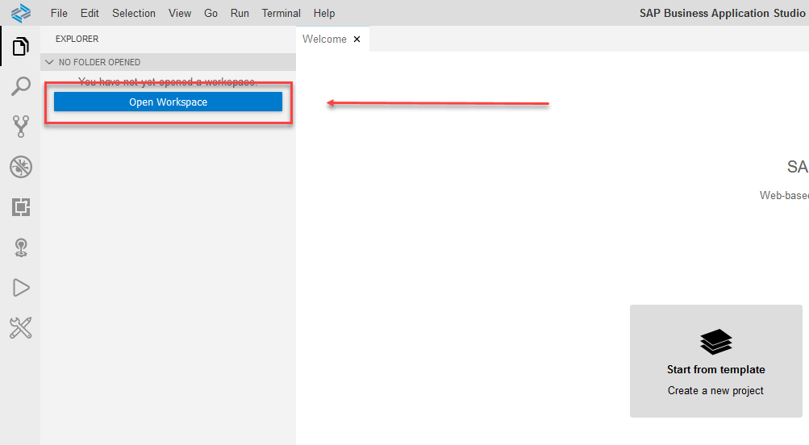
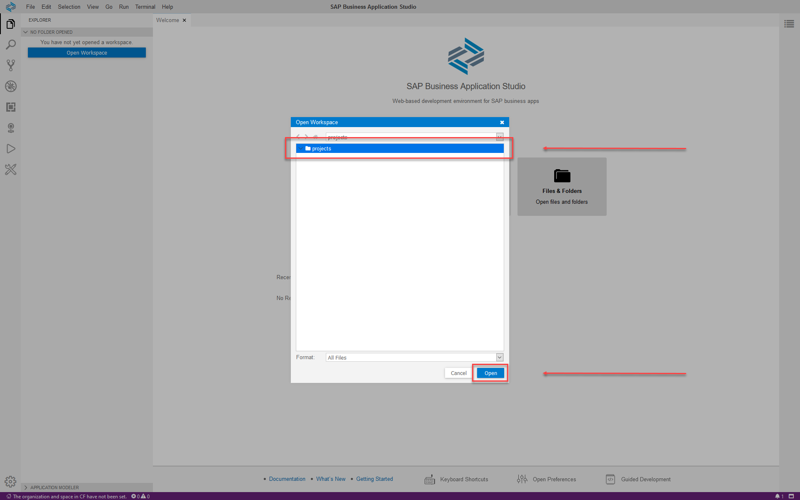
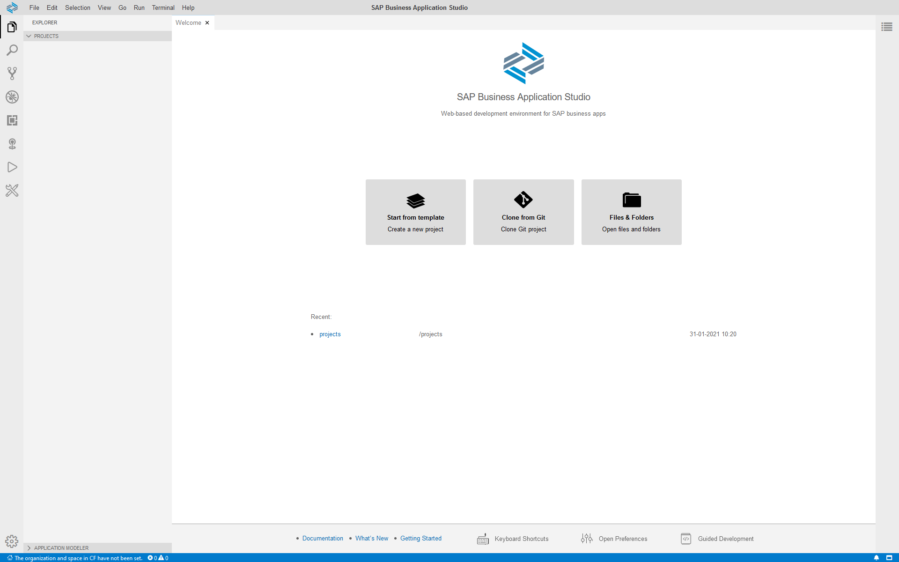
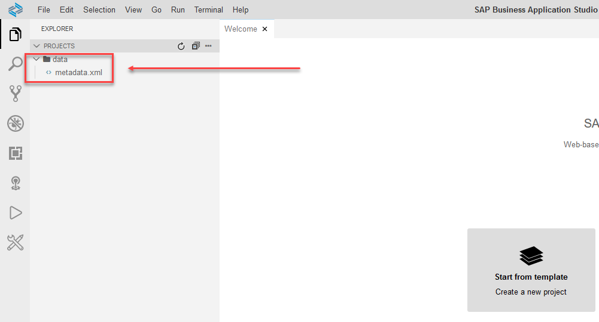
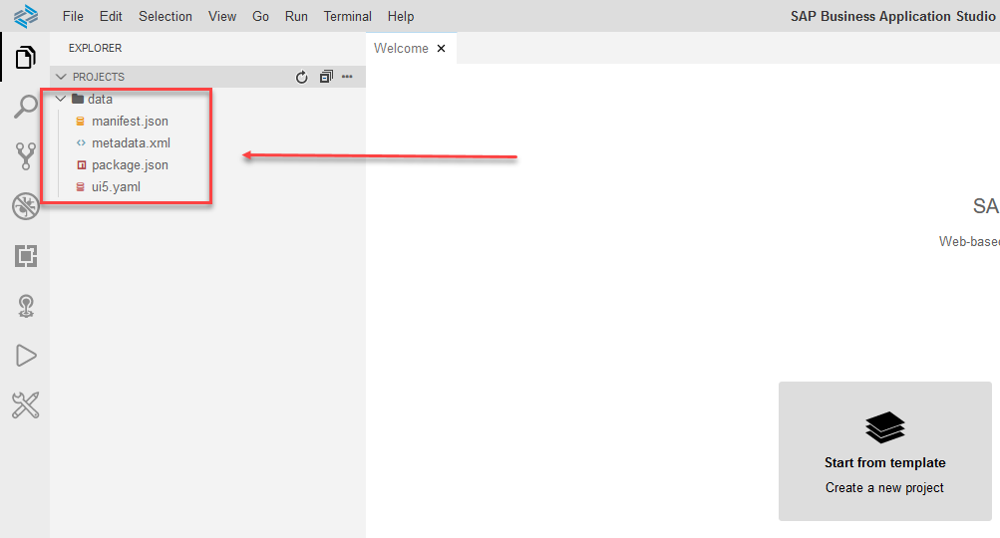

# Exercise 1 - Create SAP Fiori Dev Space

In this exercise, you will learn how to access SAP Business Application Studio and prepare it for development of an SAP Fiori app.

SAP Business Application Studio provides turn-key solutions based on what we call dev spaces. Dev spaces are like isolated virtual machines in the cloud that can be instantly spinned up. 
Each dev space type contains tailored tools and pre-installed runtimes for a target scenario such as SAP Fiori or mobile development. 
This simplifies and saves time in setting up the development environment as there’s no need to install or upgrade anything, which allows developers to focus on their business domain, anytime, anywhere. 

## Exercise 1.1 - Log in to SAP Business Application Studio

After completing these steps, you will know how to access SAP Business Application Studio.

1. Open a browser of your choice (Google Chrome, Mozilla Firefox).
    >List of supported browsers is available [here](https://help.sap.com/viewer/9d1db9835307451daa8c930fbd9ab264/Cloud/en-US/8f46c6e6f86641cc900871c903761fd4.html).

2. Go to [SAP Business Technology Platform Trial](https://account.hanatrial.ondemand.com/) page.

3. Provide your credentials, and press [ENTER] or click *Log On*.
        
    >If the log in doesn't work, make sure you fulfill the [requirements](../../README.md#requirements).

4. Click **SAP Business Application Studio** to open the *Dev Space Manager* page of SAP Business Application Studio. 
        
    >You may be prompted to accept the legal terms.

    >If the log in doesn't work, make sure you fulfill the [requirements](../../README.md#requirements).

## Exercise 1.2 - Create Dev Space 

There are several dev space types that are available for you. Each dev space type is tailored for a specific development scenario. In this session, you're developing an SAP Fiori app. Hence, you'll create a dev space of type SAP Fiori.

1. Click *Create Dev Space*.
        

2. Enter the name of your dev space, e.g. *Procurement*, select *SAP Fiori* as the application type, and click *Create Dev Space*.
        

3. Your dev space is being created. This might take a few minutes. Wait until the status shows *RUNNING*.
        
      

   >If you reached the maximum number of allowed dev spaces (2 for trial accounts), you should either use an exisiting dev space of type *SAP Fiori* or delete one of your exisiting dev spaces. Do not forget to back up your information/code.

   >If the dev space state stays *STOPPED* after creation, you may have reached the maximum number of allowed running dev spaces (1 for trial accounts). Click the *Stop* button, and then the *Start* button. Both operations can take place simultaneously, just make sure that the stop operation is started before the start operation.

4. Bookmark this URL, so it'll be easier for you to access your dev space manager. 
    >It's better to mark the dev space manager rather than the specific dev space, as dev spaces are automatically stopped after a period of time, making them inaccessible. The dev space manager link will remain active.

## Exercise 1.3 - Launch the Development Environment

1. Click on your dev space name, e.g. *Procurement*. You'll be redirected to your newly created SAP Business Application Studio dev space.
    >You may be prompted to accept the legal terms.

       

    >Tip: If you want to go back to the dev space manager page, use the bookmark you saved before or remove the text after its `index.html` in the URL, and press [ENTER].

## Exercise 1.4 - Preparations for the next exercises

After completing these steps, you will upload several files to SAP Business Application Studio that you'll need later in this session.
+ `metadata.xml` will allow you to develop the app without connecting to a backend system.
+ `ui5.yaml`, `package.json`, and `manifest.json` will be used to:
    + Demonstrate the file comparison functionality.
    + Connect the app to a backend system.

1. Click *Open Workspace*.
        

2. Select *projects*, and click *Open*.
        
    >Wait for SAP Business Application Studio to re-load.
    >   

3. From the main menu, select *File | New Folder*.
    >Using information in the popup message, verify that the new folder will be created in */home/user/projects*. If a different path is presented, it's most probably due to a file or folder being selected. Close the *New Folder* dialog, press [CTRL] and click the selected file or folder to deselct it, and repeat this step.
        

4. Name the folder *data*, and click *OK*.
        

5. Click the following [link](data/metadata.xml?raw=true) to access the `metadata.xml` file.
    >When working with GitHub, if you want to open a link in a new tab, press [CTRL] and click the link.

6. Right-click the data area, and select *Save as...*.
    >You'll save the file to your local machine.

7. Choose the folder to where the file will be saved (`Downloads` is the default folder). Use `metadata.xml` as the *File name*, and click *Save*.
    >The default file extension using this method is *txt*. Change *Save as type* to *All Files (*.*)*, and for the metadata file make sure you modify its extension to *xml*.
    >    

8. Open the folder to where you saved the file, and drag and drop it to the *data* folder you created in SAP Business Application Studio.
        

    >Follow the same steps for [ui5.yaml](data/ui5.yaml?raw=true), [package.json](data/package.json?raw=true), [manifest.json](data/manifest.json?raw=true), which will be used at a later stage of the workshop.
    >Do not forget to change the *Save as type* to *All Files (\*.\*)*, and for each file make sure you modify its extension to yaml or json.
    >  

## Summary

Congratulations, you have completed the [Create SAP Fiori Dev Space](#Exercise-1---Create-SAP-Fiori-Dev-Space) exercise!

Continue to [Exercise 2 - BAS Tour (SAP Business Application Studio Product Tour)](../ex2/README.md).
