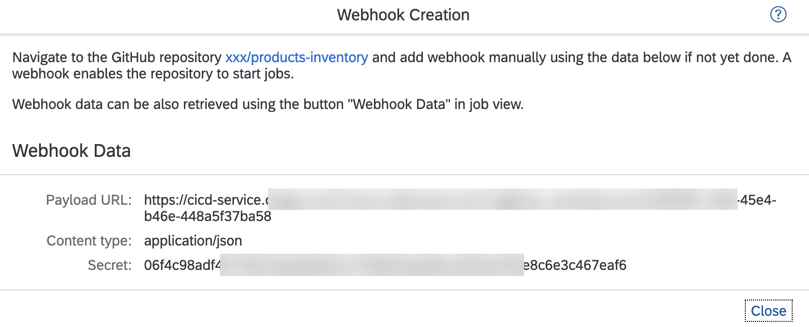

# Exercise 9 - Connect Your Project to SAP Cloud Platform Continuous Integration and Delivery Service - Setup the Service

In this exercise, we will create a project in a public GitHub repository in which to store your source code, enable SAP Cloud Platform Continuous Integration and Delivery, and configure and run a predefined continuous integration and delivery (CI/CD) pipeline that automatically tests, builds, and deploys your code changes.

## Exercise 9.4 Enable SAP Cloud Platform Continuous Integration and Delivery

After completing these steps, will have subscribed to SAP Cloud Platform Continuous Integration and Delivery and assigned the *Administrator* role to your user.

1. In your SAP Cloud Platform trial account, navigate to the **Subscriptions** tab.
Here, you can find the Continuous Integration & Delivery service:

2. Choose the service tile and then choose **Subscribe**.

3. In your SAP Cloud Platform subaccount, choose **Security** → **Trust Configuration**.

4. Choose the name of your identity provider.

5. Enter your email address.

6. Choose **Show Assignments**.
If your user is new to your subaccount, choose **Add User** in the confirmation dialog.

7. Choose **Assign Role Collection**.

8. From the drop-down list, choose **CICD Service Administrator**.

## Exercise 9.5 Configure Credentials in SAP Cloud Platform Continuous Integration and Delivery

After completing these steps, you will have configured credentials for connecting SAP Cloud Platform Continuous Integration and Delivery to other services.

1. In your SAP Cloud Platform subaccount, choose **Subscriptions**.

2. In the **Extension Suite - Development Efficiency** category, choose **Continuous Integration & Delivery**.

3. Choose **Go to Application**.

4. Use your credentials to log in to the application.

5. If your GitHub repository is private, configure credentials for it, so that the Continuous Integration & Delivery service can connect to it. **Note:** If your GitHub repository isn't private, you can skip this step.

    - In the **Credentials** tab in SAP Cloud Platform Continuous Integration and Delivery, choose **+** *(Create Credentials)*.
  
  
    - For **Name**, enter a freely chosen name for your credential, which is unique in your SAP Cloud Platform subaccount. In this example, the name of the credential is *github*.
  
    - As **Type**, select **Basic Authentication**.

    - For **Username**, enter your Github username.
  
    - For **Password**, use the personal access token, which you've created in GitHub in exercise 8.2.
     

6. To create credentials for deploying to the SAP Cloud Platform Cloud Foundry environment, go to the **Credentials** tab and choose **+** *(Create Credentials)*.

7. For **Name**, enter a freely chosen name for your credentials, which is unique in your SAP Cloud Platform subaccount. In this example, the name of the credentials is *cfdeploy*.

8. As **Type**, select **Basic Authentication**.

9. For **Username**, enter your username for the SAP Cloud Platform cockpit.

10. For **Password**, use your password for the SAP Cloud Platform cockpit.

## Exercise 9.6 Configure a CI/CD Job

After completing these steps, you will have configured a job in SAP Cloud Platform Continuous Integration and Delivery.

1. In the **Jobs** tab in SAP Cloud Platform Continuous Integration and Delivery, choose **+** *(Create Job)*.

2. For **Job Name**, enter a freely chosen name for your job, which is unique in your SAP Cloud Platform subaccount. In this example, the name of the job is *Procurement*.

3. For **Repository URL**, enter the URL of your GitHub repository.

4. If your GitHub repository is private, for **Repository Credentials**, enter the name of the credentials to access your GitHub Repository, which you've created in exercise 8.5. If your GitHub repository isn't private, leave this field empty.

5. For **Branch**, enter the GitHub branch from which you want to receive push events.

6. As **Pipeline**, choose **sap-ui5-cf**.

7. Scroll down to the **Tasks**. By default, the **Build** task is **ON**.

8. Switch the **Deploy** task on.

9. Provide the needed information for the **Deploy** task. You can get the your org name, space name, and API endpoint from your subaccount overview in the SAP Cloud Platform cockpit:

10. Choose the *cfdeploy* credentials that you'vecreated in the previous step.

11. Choose **Create**.

12. Whenever you create the first job for a GitHub repository, the **Webhook Creation** pop-up appears, which provides you with the data needed to define a webhook in GitHub. Alternatively, you can open the detail view of an existing job in the **Jobs** tab and under **General Information**, choose **Webhook Data**.

13. In your project in GitHub, go to the **Settings** tab.

14. From the navigation pane, choose **Webhooks**.

15. Choose **Add webhook**.

16. Enter the **Payload URL**, **Content type**, and **Secret** from the **Webhook Creation** pop-up in SAP Cloud Platform Continuous Integration and Delivery. For all other settings, leave the default values.

8. Choose **Add webhook**.

## Summary

You've created a project in GitHub to store your source code and successfully configured and run a predefined continuous integration and delivery pipeline that automatically builds, tests and deploys your code changes.

Continue to - [Exercise 10 - Useful CF Commands](../ex10/README.md).